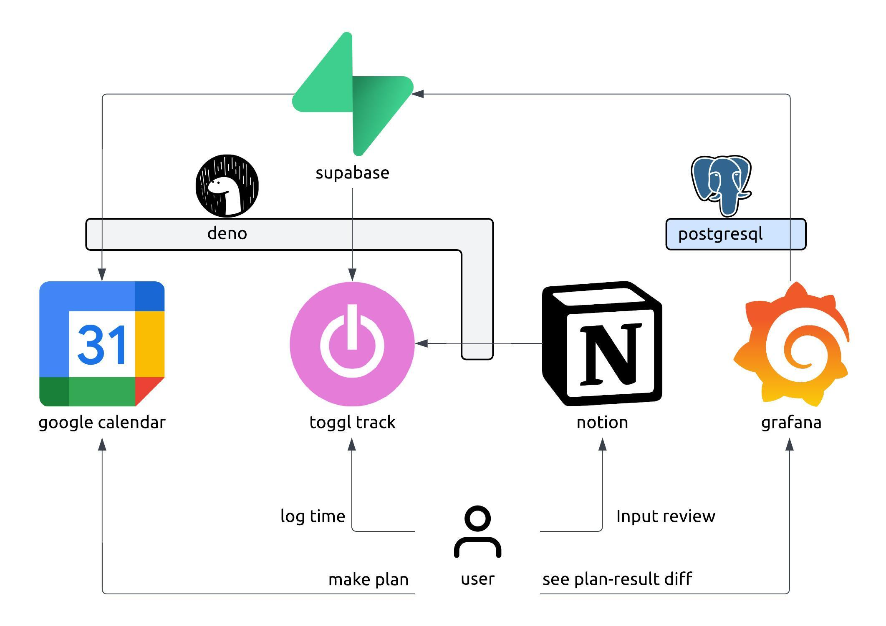

# toggl-sync
This project aims to sync toggl entries to other services.

## Runtime
- Deno
A part of this project is on Supabase Edge Functions, which uses Deno runtime.

## Environment Variables
- `TOGGL_API_TOKEN`: API token for toggl
- `TOGGL_WORKSPACE_ID`: Workspace ID for toggl

## Service Structure
